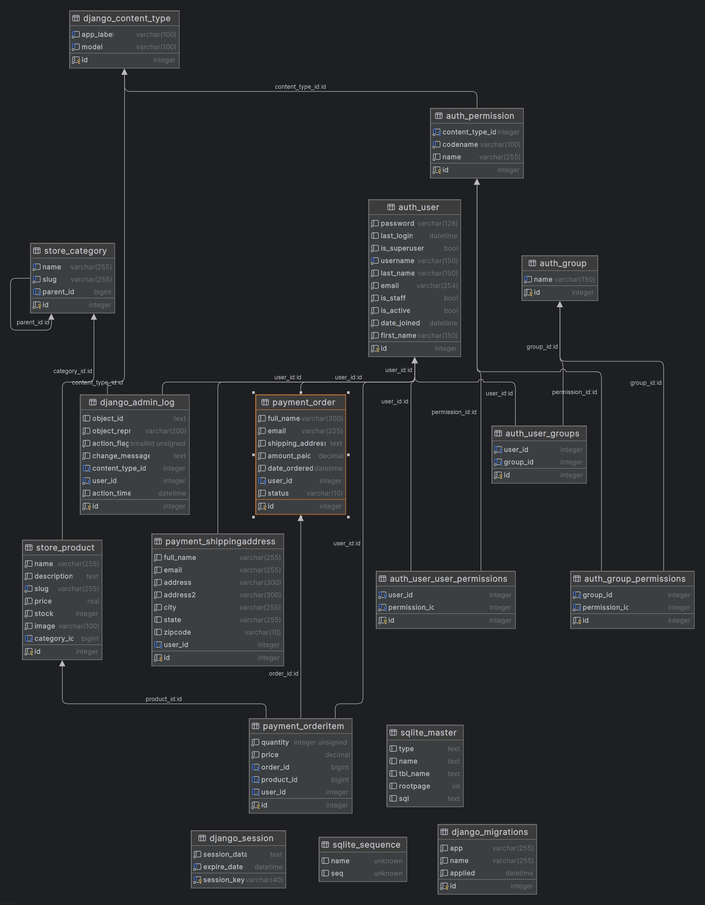

# Eshop Jerky Inferno: A Django E-commerce Platform

## Overview
Jerky Inferno is a e-commerce platform built with Django. It supports features such as user authentication, shopping cart management, payment processing, and product listing.

## Features
- User Authentication**: Register, log in, and manage user accounts.
- **Product Management**: Add, view, and manage product listings.
- **Shopping Cart**: Add products to the cart, update quantities, and review items.
- **Payment Integration**: Process payments securely.
- **Media Support**: Handle product images and other uploads.
- **Admin Panel: A powerful admin interface for managing the site, products, and users.

## Technologies Used
- **Python**: Core programming language.
- **Django**: Web framework.
- **SQLite**: Default database for development.
- **HTML/CSS/JavaScript**: Frontend components.
- **Third-party Libraries**: Listed in `requirements.txt`.

## Prerequisites
- Python 3.x
- pip (Python package manager)
- Virtual environment (recommended)

## Installation

1. **Clone the Repository**:
   ```bash
   git clone <repository_url>
   cd Eshop
   ```

2. **Set Up Virtual Environment**:
   ```bash
   python -m venv venv
   source venv/bin/activate # On Windows: venv\Scripts\activate
   ```

3. **Install Dependencies**:
   ```bash
   pip install -r requirements.txt
   ```

4. **Apply Database Migrations**:
   ```bash
   python manage.py migrate
   ```

5. **Run Development Server**:
   ```bash
   python manage.py runserver
   ```

6. **Access the Application**:
   Open `http://127.0.0.1:8000/` in your web browser.

## Project Structure
- `manage.py`: Django's command-line utility.
- `account/`: User authentication and profile management.
- `cart/`: Shopping cart functionality.
- `payment/`: Payment integration logic.
- `store/`: Product and inventory management.
- `templates/`: HTML templates for the project.
- `static/`: Static assets like CSS and JavaScript.
- `media/`: Directory for uploaded files.
- `requirements.txt`: Dependencies for the project.

## Entity Relationship Diagram



## Testing
Run the test suite using:
```bash
python manage.py test
```

## Contact
For any questions or feedback, reach out to:
- **Email**: [jakubtrnka16@gmail.com](mailto:jakubtrnka16@gmail.com)
- **GitHub**: [https://github.com/jtrnka16](https://github.com/jtrnka16)
